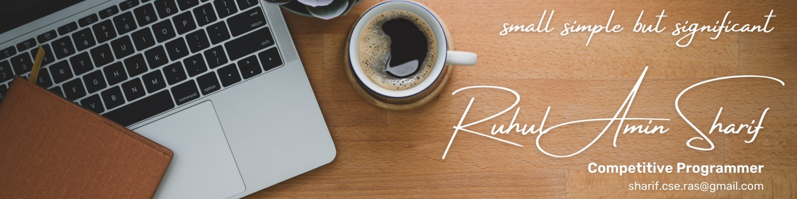

  
  # Hi there, I'm Ruhul Amin Sharif! 👋

  

    

  

    
    
    
    
  

### 🔭 About Me

👋 Hello! I'm Ruhul Amin Sharif, a passionate Computer Vision enthusiast and aspiring Machine Learning engineer.

- 🎓 I'm currently a Computer Science and Engineering (CSE) student at **Premier University, Chittagong**.
- 🌱 I'm open to collaborate in **MERN-based** project.
- 🌱 I'm currently learning and exploring **Egocentric AI**.
- 🤖 My primary focus is on **Computer Vision** and the cutting-edge field of **Egocentric AI** (**first-person vision**). I'm fascinated by the challenge of analyzing data from a first-person perspective to understand human activities and interactions.
- 📫 How to reach me: <a href="mailto:sharif.cse.ras@gmail.com">sharif.cse.ras@gmail.com</a>
- ⚡ Fun fact: I love solving complex problems and turning ideas into reality through code!

<h2 style="color: #36BCF7FF;"> 💻 Tech & Tool Stack </h2>

  

    <kbd>
      <kbd>Programming Languages</kbd>
       
       
      
       
       
      
       
    </kbd>
    <kbd>
      <kbd>Back-end</kbd>
       
       
      
      
<!--        -->
<!--        -->
    </kbd>
<!--      <kbd> -->
<!--       <kbd>Mobile App</kbd> -->
<!--         -->
<!--         -->
<!--        -->
<!--        -->
<!--     </kbd> -->
    <kbd>
      <kbd>Front-end</kbd>
       
       
       
       
       
<!--        -->
<!--        -->
    </kbd>
    <kbd>
      <kbd>Database</kbd>
       
       
      
      
<!--        -->
<!--        -->
    </kbd>
     
     
    <kbd>
      <kbd>Data Science & AI</kbd>
       
       
      
      
      
      
    </kbd>
  

### 📊 My GitHub Stats

  <h3>📈 GitHub Activity Graph</h3>
  
  

      <h3>📜 Language and Overview</h3>
      

        
        
      

    

   
  

    

      <h3>📜 Overall GitHub Stats</h3>  
      

        
        
        
      

    

    

      <h3>🔥 GitHub Streak</h3>
      
    

  

