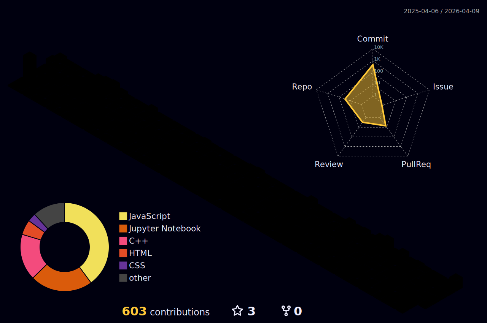

<h1 align="center">Hi 👋, I'm Ruhul Amin Sharif</h1>

  

<h2 style="color: #36BCF7FF;"> 💫 About Me</h2> 

I am a fouth-year undergraduate student at Premier University Chattogram studying Computer Science and Engineering. I am highly interested in <strong>algorithmic problem-solving.</strong>
  

<ul>  
  <li>🔭 I’m currently studying in <strong>Computer Science and Engineering</strong></li>
  <li>👯 I’m open to collaborating on <strong>Laravel Development</strong></li>  
  <li>🌱 I'm currently learning <strong>Machine Learning and Deep Learning</strong>.</li>  
  <li> 👨‍💻 All of my projects are available at https://linkmix.co/38238046 </li>
  <li>📫 You can reach me at <a href="mailto:sharif.cse.ras@gmail.com">sharif.cse.ras@gmail.com</a></li>  
</ul>

<h2 style="color: #36BCF7FF;"> 💻 Tech & Tool Stack </h2>

  

    <kbd>
      <kbd>Programming Languages</kbd>
       
       
      
       
       
      
       
    </kbd>
    <kbd>
      <kbd>Back-end</kbd>
       
       
      
      
<!--        -->
<!--        -->
    </kbd>
<!--      <kbd> -->
<!--       <kbd>Mobile App</kbd> -->
<!--         -->
<!--         -->
<!--        -->
<!--        -->
<!--     </kbd> -->
    <kbd>
      <kbd>Front-end</kbd>
       
       
       
       
       
<!--        -->
<!--        -->
    </kbd>
    <kbd>
      <kbd>Database</kbd>
       
       
      
      
<!--        -->
<!--        -->
    </kbd>
     
     
    <kbd>
      <kbd>Data Science & AI</kbd>
       
       
      
      
      
      
    </kbd>
  

<h2 style="color: #36BCF7FF;">🌐 Connect with Me</h2>

  
  

<h2 style="color: #36BCF7FF;">📊 My Stats</h2>  
<!--

  

-->

  <h3>📈 GitHub Activity Graph</h3>
  

<!-- Section 2: Language and Overview Stats -->

  <h3>📜 Language and Overview</h3>
  

<h3 align="center">Last Year Stat</h3>

