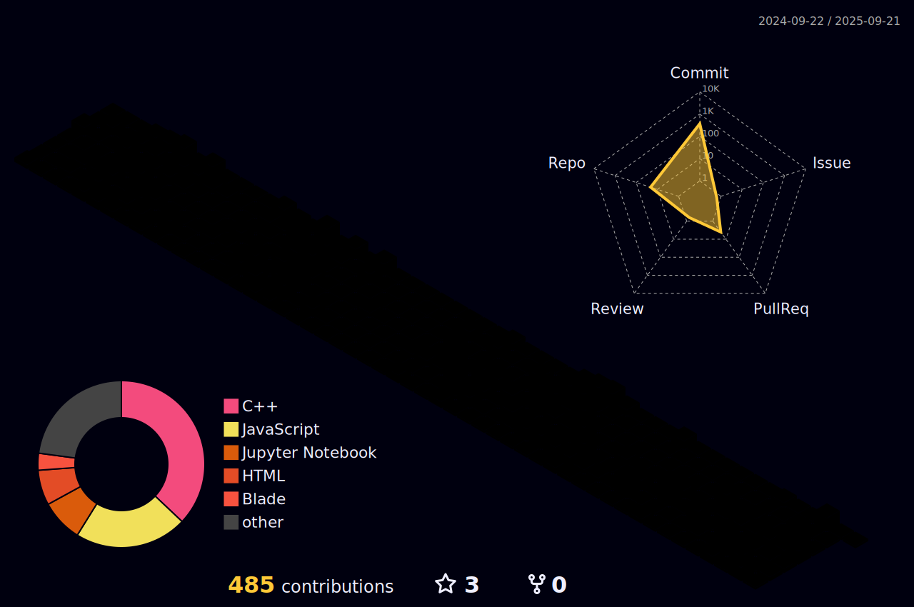

  

  

<h2 style="color: #36BCF7FF;"> 💫 About Me</h2> 

I am a fouth-year undergraduate student at Premier University Chattogram studying Computer Science and Engineering. I am highly interested in <strong>algorithmic problem-solving.</strong>
  

<ul>  
  <li>👯 I’m open to collaborating on <strong>Android App Development</strong> using Flutter</li>  
  <li>🌱 Currently learning <strong>ML</strong> to cope with present and future tech.</li>  
  <li>📫 You can reach me at <a href="mailto:sharif.cse.ras@gmail.com">sharif.cse.ras@gmail.com</a></li>  
<!--   <li>👨‍💻 Check out my projects on my <a href="https://shahadathhs.vercel.app">Portfolio</a></li>   -->
  <li>📄 My <a href="https://flowcv.com/resume/ehrfeb5slc">Resume</a></li>  
</ul>

<h2 style="color: #36BCF7FF;"> 💻 Tech & Tool Stack </h2>

  

    <kbd>
      <kbd>Programming Languages</kbd>
       
       
      
       
       
      
       
    </kbd>
    <kbd>
      <kbd>Back-end</kbd>
       
       
      
      
<!--        -->
<!--        -->
    </kbd>
     <kbd>
      <kbd>Mobile App</kbd>
       
       
      
<!--        -->
    </kbd>
    <kbd>
      <kbd>Front-end</kbd>
       
       
       
       
       
<!--        -->
<!--        -->
    </kbd>
    <kbd>
      <kbd>Database</kbd>
       
       
      
      
<!--        -->
<!--        -->
    </kbd>
     
     
    <kbd>
      <kbd>Data Science & AI</kbd>
       
       
      
      
      
      
    </kbd>
  

<h2 style="color: #36BCF7FF;">🌐 Connect with Me</h2>

  
  
<!--    -->

<h2 style="color: #36BCF7FF;">📊 GitHub Stats</h2>  

